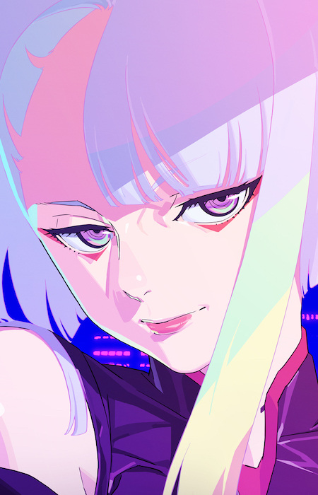
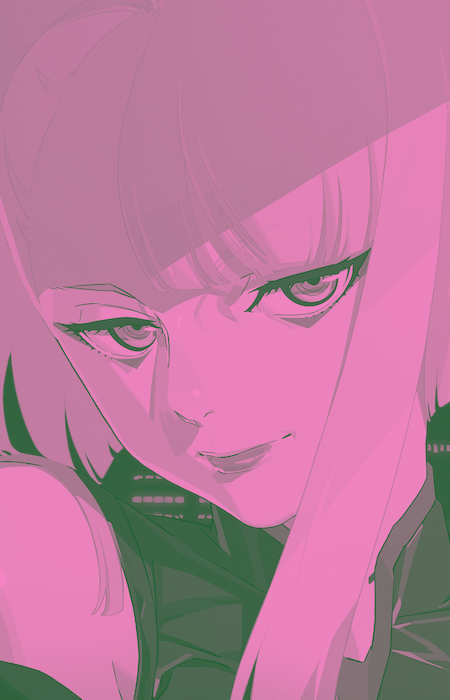

# Duotone by Lyntom 
> Ubah foto biasa jadi duotone dalam hitungan detik!

## 🎨 Tentang
Duotone by Lyntom adalah web-app sederhana berbasis HTML/CSS/JS yang mengubah foto JPG/PNG menjadi efek duotone dua warna ikonik: **Brave Pink (#f784c5)** dan **Hero Green (#1b602f)**.  
Tanpa instalasi, tanpa daftar—cukup drag-drop atau klik, lalu unduh hasilnya.

## ✨ Fitur
- Drag & drop atau klik untuk unggah (maks. 50 MB)  
- Preview real-time: foto asli vs hasil duotone  
- Unduh langsung sebagai PNG  
- Loading animasi & empty state yang ramah  
- Desain glassmorphism + gradient background  
- 100 % client-side, data tidak diunggah ke server

## 🚀 Cara Pakai
1. Buka `index.html` di browser (Chrome, Firefox, Safari, Edge)  
2. Letakkan foto ke area unggah atau klik untuk memilih file  
3. Tunggu 1-2 detik hingga preview muncul  
4. Klik tombol **Unduh** untuk menyimpan hasil duotone

## 🛠️ Teknologi
- HTML5 + Tailwind CSS 3.4.17  
- Canvas API (image processing)  
- Vanilla JavaScript (ES6)  
- Google Fonts (optional, jika di-custom)

## 📸 Contoh Hasil
| Foto Asli | Setelah Duotone |
|-----------|-----------------|
|  |  |

## 📜 Lisensi
MIT – bebas dipakai, diubah, disebarluaskan.  
Cukup berikan credit: “Duotone by Lyntom”.

## 🤝 Kontribusi
Pull-request & issue dipersilakan.  

## 📧 Kontak
[instagram.com/lyntom_irfan](https://instagram.com/lyntom_irfan)